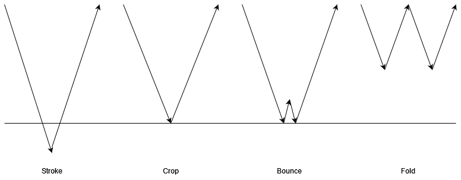

# FunscriptDancer

An app for generating Funscript files based on a media file.

Should work on Windows, MacOS (untested, Intel only due to dependencies) and Linux.

## External Dependencies

Audio analysis is performed with the following external program and libraries that need to be installed:

[Sonic Annotator](https://vamp-plugins.org/sonic-annotator/)

Download and unzip this somewhere, and add the folder containing the executable to the PATH environment variable [(For Windows)](https://www.computerhope.com/issues/ch000549.htm).

[Vamp Plugin Pack](https://code.soundsoftware.ac.uk/projects/vamp-plugin-pack)

Only `BBC Vamp Plugins` and `Vamp Aubio Plugins` are required.

Note that the word length (32 bit or 64 bit) of `sonic-annotator` and the Vamp plugins must match. If in doubt, you probably want the 64 bit versions.

## Running from source

Install Julia, e.g. by using [Juliaup](https://github.com/JuliaLang/juliaup).

Check out this repo.

Open a command line and navigate to the root of the repo (the folder containing `project.toml`).

Start Julia with the command `julia --project --threads auto`

To install Julia dependencies enter `using Pkg; Pkg.instantiate()` from the Julia prompt. This only needs to be done once.

To run, enter `using FunscriptDancer; julia_main()"`. This will precompile the project and then run it.

Or run `julia --project --threads auto -e "using FunscriptDancer; julia_main()"` from the OS command prompt at the repo root.

Be aware that Julia is just-in-time compiled. Each bit of code will be compiled when it is called for the first time in an execution: on subsequent calls it is faster than any interpreted language like Python would be. Once the Funscript preview is visible it should be snappy: until then, expect sluggishness.

## Prepackaged binaries

In principle it is possible to build relocatable packages for Windows/MacOS/Linux using Julia.

In practice there are issues.

Prepackaged binaries are not currently available.

## How it works

Audio is extracted from the media file using (bundled) FFMPEG as a WAV. This is because Sonic Annotator has limited audio format support, which doesn't include AAC, and extracting WAV is quickest.

Sonic Annotator is used to generate beats, pitch and RMS energy. These are exported by Sonic Annotator as CSV files. The pitch and the energy are kept: if these are present for a file then re-analysing is unnecessary.

The audio data used to generate the Funscript can be cropped by clicking on the left/right halves of the audio preview. This is useful to remove sound effects or intro/outro music from the beginning/end of the media that would distort the Funscript.

Each beat is one full stroke, including up and down.

The centre position of the stroke is based on the (logarithm of) pitch, the amplitute on energy.

There are two sliders to control the influence of pitch and energy.

Three strategies are selectable using radio buttons to determine how to handle a stroke that would go above 100 or below 0:

Crop: set the stroke's point to 0 or 100. This will lose total travel.

Bounce: the portion of the stroke that would be out of bounds is inverted back towards the centre. Preserves total travel.

Fold: the stroke goes to its half point, comes back to the start position, then to back to its halfway point, and then back again. Preserves total travel.

